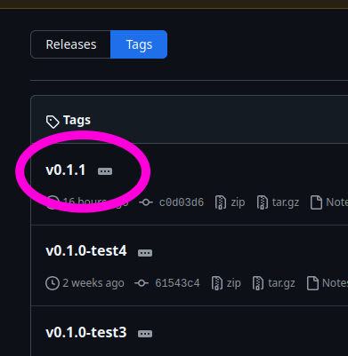

# Ferroci Analyzer

Electrochemical Data Analysis Tool with GUI for processing cyclic voltammetry data.

## Features

- Drag-and-drop CSV file interface
- Automatic reference file detection
- Extensible metrics system
- Real-time plotting with plotly
- Export to CSV and Excel
- Windows executable support via PyInstaller


## Run it on Windows





## Installation

### 1. Install Dependencies

```bash
uv sync --group dev
```

### 2. Run the Application

```bash
uv run python3 main.py
```

## Usage

### Processing Files

1. **First Time (No data.csv exists)**:
   - Drag and drop your reference CSV file first
   - The first file will be set as the reference
   - Then drag and drop test files to compare against the reference

2. **Subsequent Uses (data.csv exists)**:
   - Drag and drop new test files
   - They will be compared against the existing reference
   - Results will be appended to data.csv

### Output Files

The application creates two output files in the same directory as your CSV files:

- `data.csv`: Contains all metadata and calculated metrics
- `data.xlsx`: Excel version of the data

### Plot

The plot shows:
- **Reference curve**: Thick red line
- **Test curves**: Normal thickness with different colors

## Adding New Metrics

The application uses an extensible metrics system. To add a new metric:

### 1. Create Metric Class

Create a new file in `core/metrics/`, for example `core/metrics/peak_height.py`:

```python
from core.metrics.base_metric import BaseMetric
import pandas as pd

class PeakHeightMetric(BaseMetric):
    def get_name(self) -> str:
        return "Peak_Height"

    def get_description(self) -> str:
        return "Maximum current value in the curve"

    def calculate(self, data_df: pd.DataFrame, ref_data_df: pd.DataFrame) -> float:
        return data_df["Current_A"].max()
```

### 2. Register in main.py

Add these lines to `main.py`:

```python
from core.metrics.peak_height import PeakHeightMetric

# In the main() function:
registry.register(PeakHeightMetric())
```

That's it! Your new metric will automatically:
- Appear in the results table
- Be saved to CSV and Excel
- Be calculated for all processed files

See `core/metrics/example_metric.py` for a template.

## Building Windows Executable

### 1. Build Executable

```bash
uv run pyinstaller ferroci_analyzer.spec
```

The executable will be in the `dist/` directory.

### 2. Test Executable

Enter `dist/` directory. Double click on FerrociAnalyzer.

## File Structure

```
BO_lysoAI/
├── main.py                          # Application entry point
├── config.py                        # Configuration constants
├── read_ferro_bare.py               # Existing CSV parser (no changes)
├── requirements.txt                 # Python dependencies
├── ferroci_analyzer.spec           # PyInstaller configuration
│
├── app/
│   ├── main_window.py              # Main application window
│   └── widgets/
│       ├── drop_zone.py            # Drag-drop widget
│       ├── plot_widget.py          # Matplotlib plot
│       ├── results_table.py        # Results table
│       └── status_log.py           # Status messages
│
├── core/
│   ├── metrics_registry.py         # Metrics management
│   ├── data_processor.py           # File processing
│   ├── file_manager.py             # File operations
│   └── metrics/
│       ├── base_metric.py          # Abstract base class
│       ├── curve_difference.py     # Sum of abs differences
│       ├── min_max_range.py        # Min-max range
│       └── example_metric.py       # Template for new metrics
│
└── utils/
    └── (utility modules)
```

## Current Metrics

The application calculates two metrics by default:

1. **Sum_Abs_Difference**: Integral of absolute differences between test and reference curves
2. **Min_Max_Range**: Range (max - min) of differences between curves

## Data Format

The application reads CSV files with the format from CHI760D instruments:
- Metadata section (lines 1-24)
- Data section with columns: `Potential/V, Current/A`

## Troubleshooting

### Files not processing
- Ensure CSV files are in the correct format
- Check that the directory is writable
- Look at the status log for error messages

## TO DO

- plotly does not save or auto-save the plots
- only show auto-processed rows in UI (?)
- generalized data-reader
    - general purpose csv
    - binary files converter (upon drag and drop)
    - ...only convert binaries. Do not show them.
- more dynamic column naming? -> nooo
- improve metric names (Sum_Abs_Difference iiiih)
- more interactive plot (adjust line thickness etc)
- normalize integration with potential range
- tangent for current diffs (max vs. base current)
